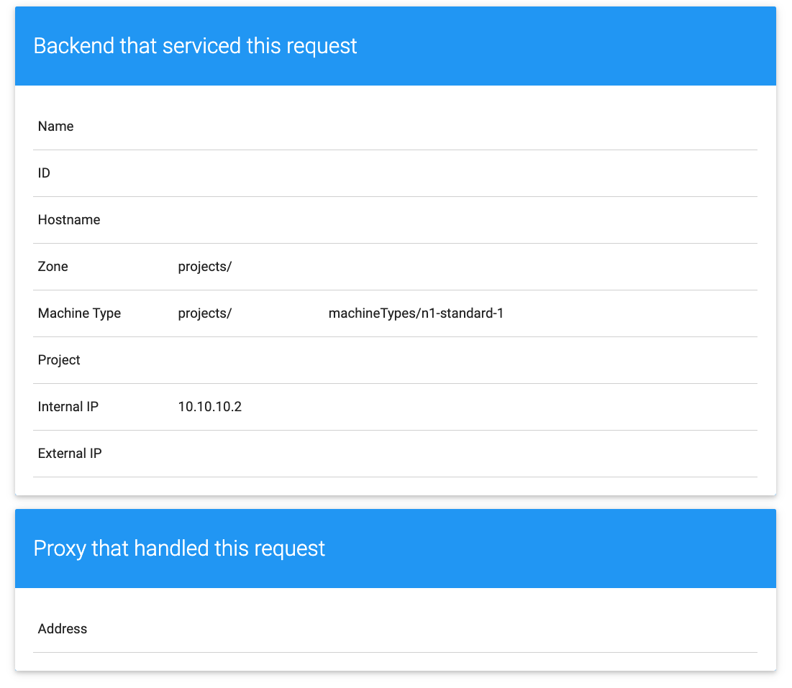

# Cloud Foundation Toolkit Lab - 04-Load-Balancer

## Prerequisite

Complete previous labs
* **[00-Setup](../00-Setup/README.md)**
* **[01-IAM](../01-IAM/README.md)**
* **[02-Networking](../02-Networking/README.md)**
* **[03-Instance-Group](../03-Instance-Group/README.md)**

You should have [Google Cloud SDK](https://cloud.google.com/sdk/docs/downloads-interactive) installed and configured before continuing, otherwise refer to [00-Setup](../00-Setup/README.md)

## Global HTTP(S) Load Balancer

This lab helps you create a Global HTTP(S) Load Balancer using Cloud Foundation Toolkit.

At the end of this exercise, you'll have a global HTTP(S) Load Balancer with a single external IP backed by the Managed Instance Group VM instances you've created in the [03-Instance-Group](../03-Instance-Group/README.md) labs.

**Note**: You can have input variables as

* **default** in `variables.tf`
* using [terraform.tfvars](https://www.terraform.io/docs/configuration/variables.html#variable-definitions-tfvars-files)
* command line argument `-var='key=value'`

### What You'll Learn

* [Cloud Foundation Toolkit](https://cloud.google.com/foundation-toolkit/)
* [terraform-google-lb-http](https://github.com/terraform-google-modules/terraform-google-lb-http)
* [Global HTTP(S) Load Balancer](https://cloud.google.com/load-balancing/docs/https)

## Task 1. Create HTTP Load Balancer

Use the Cloud Foundation Toolkit [Global HTTP(S) Load Balancer](https://github.com/terraform-google-modules/terraform-google-lb-http) module in `main.tf` to create a Global HTTP Load Balancer with Managed Instance Group from [03-Instance-Group](../03-Instance-Group/README.md) as the backend

**VPC Network**, **Cloud NAT**, **Instance Template** and **Managed Instance Group** provided in `network.tf` and `mig.tf`

## Task 2. Configurations

### `backend.tf`

Fill in `backend.tf` the bucket name created from [00-Setup](../00-Setup/README.md)

### `terraform.tfvars`

Make a copy of the example `.tfvar` file and populate details.
```
cp terraform.example.tfvars terraform.tfvars
```

## Task 3. Terraform

### Terraform Init & Plan

Init and review Terraform execution plan

```
terraform init
terraform plan -out=plan.out
```

### Terraform Apply

Execute previous generated execution plan

```
terraform apply plan.out
```

## Task 4. Verify

On [Google Cloud Console](https://console.cloud.google.com/), navigate to **Network services -> Load balancing**

Review the new **Load Balancer**

From the output of `terraform apply`, you will see the External IP for load balancer (`load_balancer_ip`)

Open a browser and enter the IP address, you should see a response similar to the image below



## Task 5. Clean Up

Destroy resources created by Terraform

```
terraform destroy
```
